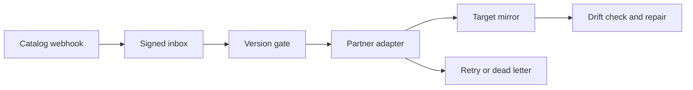

# Relay Sync

**A recoverable catalog integration for unreliable partner systems.** A retailer sends product updates from a source catalog to an external storefront. Webhooks can repeat or arrive out of order, partner APIs can fail after accepting a request, and an operator can change the storefront without updating the catalog. Relay Sync exposes those failures and gives an operator a way to repair them.

This is original reference code with fictional products. The optional HTTPS adapter speaks a generic contract; there is no Shopify, Inriver, or customer connection.

## Try the complete incident

Python 3.12+ and the standard library are sufficient.

```bash
python3 -m unittest discover -s tests -v
python3 -m relay.demo
```

The narrated demo sends version 2 before version 1, replays a duplicate, corrupts the target price, repairs the drift, fails partner delivery three times, and replays the dead-lettered event. It prints the audit trail and final target state.

## Run the operator dashboard

```bash
RELAY_WEBHOOK_SECRET='replace-with-a-local-test-secret' \
RELAY_OPERATOR_KEY='replace-with-a-local-operator-key' \
python3 -m relay.server
```

Open **http://127.0.0.1:8083** and enter the value of `RELAY_OPERATOR_KEY`. Generate a synthetic event, process it, simulate a manual storefront edit, then repair the drift. The UI reads the actual local SQLite engine. State persists in `relay.sqlite3`; set `RELAY_DB` to use another file. The server binds only to loopback and requires the operator key for state and mutations. The demo seed and drift controls are intentionally operator-only.

To exercise the signed webhook without the dashboard:

```bash
python3 -m relay.cli receive examples/product.json
python3 -m relay.cli process
python3 -m relay.cli inspect
python3 -m relay.cli reconcile --repair
```

The CLI signs the example with its local demo secret for convenience. A real source must sign the exact request bytes and send the digest in `X-Relay-Signature` to `POST /webhooks/catalog`; the operator routes use `Authorization: Bearer <RELAY_OPERATOR_KEY>`.

| Route | Purpose |
| --- | --- |
| `POST /webhooks/catalog` | Signed webhook intake, idempotent by event ID |
| `POST /api/process` | Process due inbox rows and retries |
| `GET /api/metrics`, `GET /api/state` | Queue health, drift, product mirrors, audit |
| `POST /api/reconcile` | Preview drift or repair with `{"repair":true}` |
| `POST /api/replay/{event_id}` | Replay a dead-lettered event |
| `POST /api/demo/seed`, `POST /api/demo/drift` | Generate fictional input and a visible target mismatch |

## Delivery contract



- Verify HMAC-SHA256 over raw bytes before parsing. Reject invalid signatures, oversized payloads, unknown fields, invalid dates, and reused event IDs with different content.
- Apply only newer versions per product. A matching older or equal event is stale; an equal version with different product data is quarantined as a dead letter for investigation.
- Retry temporary partner failures with bounded exponential backoff. Permanent 4xx responses are dead-lettered. Operators can replay dead letters after resolving the cause.
- Compare source-owned fields (`name`, `price_cents`, `version`) against the target mirror. A repair writes the source snapshot and records an audit entry.
- Report pending and dead counts, oldest pending time, product counts, and drifted products in the dashboard.

To enable an external partner, set `RELAY_PARTNER_URL=https://...` and `RELAY_PARTNER_TOKEN=...`. The adapter sends a JSON POST with `X-Idempotency-Key: <event_id>`, requires HTTPS, rejects redirects, and treats 408/425/429/5xx as retryable. **The receiving endpoint must durably deduplicate that key.** If it accepts a request but Relay crashes before recording success, the next attempt may send it again. Do not point the adapter at a real partner until both parties agree on field ownership, idempotency, retry semantics, rate limits, and recovery procedures.

## Design limits

The default target mirror and source snapshot share one SQLite transaction, making the offline demo deterministic. With an external endpoint, there is no atomic transaction across the remote side effect and the local database; the idempotency contract handles the uncertain-response window. This process has one SQLite writer, a manual worker tick, no distributed queue, and no production identity provider. A production deployment would add a scheduled worker, tenant and partner identity, secrets management, retention rules, tracing, a durable receiver contract, source snapshot ingestion, and measured recovery SLOs. The dashboard is loopback-only; it is not a hosted customer service.

For a pilot, measure oldest pending age, dead-letter count, drift rate, time to converge after updates, and manual interventions. The tests verify failure handling with synthetic data, not customer outcomes or production throughput.
